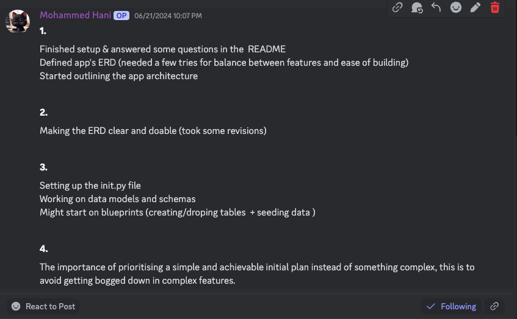
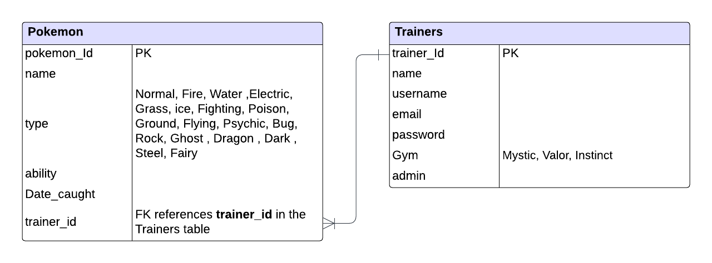

# T2A2: API Webserver POKEMON API

## Table of Contents

- [Problem and Solution](#r1-problem-and-solution)
- [Task Allocation and Tracking](#r2-task-allocation-and-tracking)
- [Third-Party Services and Dependencies](#r3-third-party-services-and-dependencies)
- [Database System: Benefits and Drawbacks](#r4-database-system-benefits-and-drawbacks)
- [ORM: Features and Functionalities](#r5-orm-features-and-functionalities)
- [Models and Relationships](#r6-models-and-relationships)
- [Database Implementation During Development](#r7-database-implementation-during-development)
- [API Endpoints Usage](#r8-api-endpoints-usage)

## R1 Problem and Solution

### Problem

The current state of Pokemon game development presents a challenge for both experienced and novice programmers because of the overwhelming amount of information and complexity involved. The widely used [PokéAPI](https://pokeapi.co/) provides a comprehensive dataset including tens of thousands of Pokemon, moves, items, abilities, and other complex details. This extensive amount of information can be overwhelming for developers in two main scenarios: when building new Pokemon games or experiences, and when new to Pokemon game development or programming in general.

For example, a developer named Sergio Perez tried to build a small application to display the original 151 Pokemon. Even for this seemingly simple task, he had to make multiple requests to the PokeAPI to retrieve all the necessary data. This illustrates the challenges developers face when working with such a comprehensive dataset. This article can be found here [Fetching Them All: Poke API](https://medium.com/@sergio13prez/fetching-them-all-poke-api-62ca580981a2)

### Solution

To address this issue, this is where this Pokemon API comes into play. This API provides a wealth of information about Pokemon, such as their types, abilities. It also includes details about trainers' affiliations with gyms. The goal of this API is to make Pokemon game development more accessible to aspiring programmers by presenting a simplified and well-documented interface, thus lowering the barrier to entry for beginners.

This simplified Pokemon API has the potential to lead to faster development and more diverse Pokemon games by reducing development hurdles and attracting new programmers. Ultimately, this API aims to contribute to a more vibrant Pokemon gaming ecosystem by solving the issue of information overload and promoting accessibility.

## R2 Task Allocation and Tracking

### [Link to Trello Board](https://trello.com/b/Jn1quw1R/pokemon-api)

All tasks are allocated and tracked through a Trello board. This allows me to visually organise tasks using cards and lists, providing a clear overview of the project's progress. The status of each task is updated as it moves through different stages of completion. Trello's features, such as due dates, labels, and comments, help me manage deadlines and prioritise work.

### This is what it currently looks like as of **20/06/2024**. More features may be added depending on the time


### progression as of **25/06/2024**


### progression as of **26/06/2024**


### progression as of **29/06/2024**


### Daily Stand-up

### 06/21/2024



### 06/24/2024


### 06/25/2024


### 06/26/2024


### 06/26/2024 - 06/29/2024 final few days was spent on just working on the document

## R3 Third-Party Services and Dependencies

### 1. Flask

Flask is a web framework used to build Python web applications. It provides a flexible and lightweight foundation for creating web APIs and dynamic web pages.

### 2. Flask-SQLAlchemy

Flask-SQLAlchemy is a Flask extension that simplifies interacting with a relational database using SQLAlchemy. It handles object-relational mapping (ORM), allowing you to define models that map to database tables and interact with them using Python objects.

### 3. SQLAlchemy

SQLAlchemy is an object-relational mapper (ORM) for Python that simplifies interacting with relational databases. It allows you to define Python classes that map to database tables and write SQL queries in Python code.

### 4. marshmallow

marshmallow is a Python library for data serialisation and deserialisation. It helps validate, serialise, and deserialise data between different formats like JSON, XML, and Python dictionaries.

### 5. Flask-marshmallow

Flask-marshmallow is a Flask extension that integrates Marshmallow with Flask. It simplifies using Marshmallow for data validation and serialisation in Flask applications.

### 6. bcrypt

bcrypt is a password hashing library for Python. It securely stores passwords by hashing them before saving them in the database. This makes it impossible to retrieve the original passwords even if the database is compromised.

### 7. Flask-Bcrypt

Flask-Bcrypt is a Flask extension for using bcrypt for password hashing in Flask applications. It simplifies integrating bcrypt with your Flask app.

### 8. Flask-JWT-Extended

Flask-JWT-Extended is a Flask extension for implementing JSON Web Tokens (JWT) based authentication in your Flask application. It provides a secure and convenient way to authenticate users and manage access to resources.

### 9. PyJWT

PyJWT is a Python library for working with JSON Web Tokens (JWT). It helps encode and decode JWT tokens used in Flask-JWT-Extended.

### 10. python-dotenv

python-dotenv is a library for loading environment variables from a .env file. It allows you to store sensitive configuration details like API keys and database credentials outside of your code for better security practices.

### 11. psycopg2-binary

psycopg2-binary is a library for connecting to PostgreSQL databases from Python. It provides a Python interface for interacting with PostgreSQL databases, which is likely the database used in this application.

## R4 Database System: Benefits and Drawbacks

### Benefits and Drawbacks of PostgreSQL

PostgreSQL is a widely used open-source object-relational database management system (ORDBMS) known for its robust features. Below are some of its advantages and disadvantages:

### Advantages

- **Robust Object-Relational Mapping (ORM):** PostgreSQL provides strong support for ORM frameworks like SQLAlchemy, which is utilised in my application. This simplifies data interaction by enabling the use of Python classes to map to database tables, resulting in cleaner and more maintainable code.

- **ACID Transactions:** PostgreSQL follows ACID properties for transactions, ensuring data integrity and consistency, especially in scenarios with simultaneous database access by multiple users or processes. This is essential for maintaining accurate data in my Pokemon API application.

- **Scalability:** PostgreSQL efficiently handles large datasets and high volumes of concurrent connections, allowing horizontal scaling by adding more servers or vertical scaling by increasing resources on the existing server as a Flask API grows in popularity and user base.

- **Rich Feature Set:** PostgreSQL offers various advanced features, including stored procedures and functions for custom logic, user-defined types (UDTs) tailored to specific application needs, and advanced indexing to enhance query performance.

- **Open-Source and Community-Driven:** Being open-source, PostgreSQL provides significant cost savings compared to restricted database systems. It also benefits from an active and extensive community providing documentation, tutorials, and support.

### Drawbacks

- **Learning Curve:** While ORM frameworks like SQLAlchemy simplify data interaction, understanding relational database concepts and SQL fundamentals is still necessary for effective database management.

- **Complexity for Simple Applications:** For very small-scale applications with basic data needs, PostgreSQL's feature set might be more complex than required, and simpler NoSQL databases might be a better fit.

- **Potential Performance Overhead for Complex Queries:** Complex queries with many joins or aggregations may tax PostgreSQL resources, requiring careful query optimisation in such cases.

- **Potential Challenges in High Availability Configurations:** Setting up high availability with failover capabilities can be more complex with PostgreSQL compared to some managed database services.

## R5 ORM: Features and Functionalities

### Model Definition and Mapping

 **Classes as Tables:** Define database tables as Python classes. Each class attribute directly maps to a column in the corresponding table, creating a natural representation of the data schema.

**Data Types:** ORMs handle data type conversions between Python types, for example, integers or strings and their corresponding database equivalents `INT` or `VARCHAR`

**Relationships:** can define relationships between models, reflecting how data tables are connected in the database, for example, one-to-many or many-to-many. This simplifies working with complex data structures.

```python
class Pokemon(db.Model):
    __tablename__ = "pokemons"
    
    id: Mapped[int] = mapped_column(primary_key=True)
    name: Mapped[str] = mapped_column(String(100), nullable=False)
    type: Mapped[str] = mapped_column(pokemon_types, nullable=False)
    ability: Mapped[str] = mapped_column(String(100), nullable=False)
    date_caught: Mapped[date] = mapped_column()
    trainer_id: Mapped[int] = mapped_column(ForeignKey("trainers.id"), nullable=True)
    trainer: Mapped["Trainer"] = relationship("Trainer", back_populates="pokemons")
```

#### In this example

`__tablename__` specifies the table name in the database. `Columns id`, `name`, `type`, `ability`, `date_caught`, and `trainer_id` are mapped to corresponding columns in the `Pokemons` table. Relationships (foreign keys) are managed using ForeignKey and relationship.

### Data Validation and Serialisation

ORM systems often integrate with libraries such as Marshmallow to handle data validation and serialisation, ensuring that data conforms to specified formats before being inserted into the database and when being retrieved.

```python
class PokemonSchema(ma.Schema):
    name = fields.String(
        validate=[
            Regexp("^[a-zA-Z]+$", error="Pokemon name must contain only letters."),
        ],
        required=True,
    )
    trainer = fields.Nested("TrainerSchema", exclude=["password", "admin", "id", "email"], allow_none=True)

    class Meta:
        fields = ("id", "name", "type", "ability", "date_caught", "trainer")
```

#### in this example

The schema validates that the `name` contains only letters.

It also Handles nested relationships, such as the relationship between `Pokemon` and `Trainer`.

### CRUD Operations

ORM offers a simplified interface for Create, Read, Update, and Delete (CRUD) operations, reducing the need to write complex SQL queries.
For example, adding new trainers and Pokemon.

```python
# Adding new trainers
trainers = [
    Trainer(
        name="Mohammed",
        username="mo123",
        email="mo@email.com",
        password=bcrypt.generate_password_hash("potatoismyfav123").decode("utf-8"),
        admin=True,
        team="Mystic",
    ),
    Trainer(
        name="John",
        username="John045",
        email="johnno@email.com",
        password=bcrypt.generate_password_hash("johnisnotmyname321").decode("utf-8"),
        team="Valor",
    ),
]
db.session.add_all(trainers)
db.session.commit()

# Adding new Pokemon
pokemons = [
    Pokemon(
        name="Squirtle",
        type="Water",
        ability="Torrent",
        date_caught=date.today(),
        trainer=trainers[0],
    ),
    Pokemon(
        name="Charmander",
        type="Fire",
        ability="Blaze",
        date_caught=date(2024, 1, 14),
        trainer=trainers[1],
    ),
    ]
db.session.add_all(pokemons)
db.session.commit()
```

These examples demonstrate the ease of adding records to the database using the ORM's session management and commit functions.

## R6 Models and Relationships



The Entity Relationship Diagram (ERD) provides a clear visual representation of the database structure, making it easier to understand the relationships between different entities. It helps organise the data in a structured manner, ensuring that all necessary entities and their attributes are accounted for.

### The database consists of two main tables

### Pokemon

#### Attributes:

```sql
pokemon_Id (PK)
name
type (Values: Normal, Fire, Water, Electric, Grass, Ice, Fighting, Poison, Ground, Flying, Psychic, Bug, Rock, Ghost, Dragon, Dark, Steel, Fairy)
ability
date_caught
trainer_id (FK)
```

- **Description:** The Pokemon table contains information about each Pokemon.
- **Primary Key:** `pokemon_Id` uniquely identifies each Pokemon
- **Foriegn Key:** `trainer_id` references the `id` in the trainers table.

### Trainers

#### Attributes:

```sql
trainer_Id (PK)
name
username
email
password
Gym (Values: Mystic, Valor, Instinct)
admin
```

- **Description:** The Trainers table stores information about each trainer, including their credentials for authentication and their affiliation with a specific gym.
- **Primary Key:** `trainer_Id` uniquely identifies each trainer.

### Benefits of the ERD in Database Design

### Clarity and Planning

**Visualisation:** The ERD provides a clear visual representation of the database structure, making it easier to understand the relationships between different entities.
**Organistion:** It helps organise the data in a structured manner, ensuring that all necessary entities and their attributes are accounted for.

### Normalisation

**Avoiding Redundancy:** The ERD helps in normalising the database by eliminating redundant data, ensuring that each piece of information is stored in the appropriate table.

**Data Integrity:** Ensures that data is stored in only one place, reducing the chances of data anomalies and maintaining consistency.

### Defining Relationships

**Foreign Keys:** The use of foreign keys (FK) enforces referential integrity, ensuring that relationships between tables are maintained correctly. For instance, trainer_id in the Pokemon table must match a valid trainer_Id in the Trainers table.

**Relationships:** Clearly defines how entities relate to each other one-to-many or many-to-many, aiding in the correct implementation of business rules. In this ERD, a one-to-many relationship is depicted between Trainers and Pokemon, as each trainer can have multiple Pokemon.

## R7 Database Implementation During Development

The Entity Relationship Diagram (ERD) shows the structure and organisation of the database. When coding starts, these models and their relationships are used in the database management system (DBMS). The detailed explanation includes the implemented models, their relationships, and comparisons of normalisation.

### Implemented Models

### Pokemon

#### Attributes:

```sql
pokemon_Id (PK)
name
type
ability
date_caught
trainer_id (FK)
```

**Description:** The Pokemon table contains information about each Pokemon. The primary key `pokemon_Id` uniquely identifies each Pokemon, while `trainer_id` is a foreign key that links to the Trainers table.

### Trainers

#### Attributes:

```sql
trainer_Id (PK)
name
username
email
password
Gym
admin
```

**Description:** The Trainers table stores information about each trainer. The primary key `trainer_Id` uniquely identifies each trainer.

### Relationships

The ERD illustrates a one-to-many relationship between Trainers and Pokemon. This means that each trainer can have multiple Pokemon, but each Pokemon is associated with only one trainer.

### Normalisation

Normalisation is the process of organising data to reduce redundancy and improve data integrity. The entities represented in the ERD are in the third normal form (3NF), ensuring that all attributes are dependent on the primary key and nothing else.

### Comparison of Normalisation Levels

#### Second Normal Form (2NF)

In 2NF, we ensure that all non-key attributes are fully dependent on the entire primary key. For example, if a Pokemon can have multiple types, we need to separate the types into another table to achieve 2NF.

### Pokemon Table:

| Pokemon_ID | Name      | Ability  | Date_Caught | Trainer_ID |
|------------|-----------|----------|-------------|------------|
| 1          | Haunter   | Levitate | 2024-02-25  | 101        |
| 2          | Bulbasaur | Overgrow | 2023-12-24  | 102        |

### Pokemon_Types Table:

| Pokemon_ID | Type     |
|------------|----------|
| 1          | Ghost    |
| 1          | Poison   |
| 2          | Grass    |
| 2          | Poison   |

This ensures that each type is fully dependent on the entire primary key (Pokemon_ID + Type).

#### Third Normal Form (3NF)

In 3NF, we ensure that all attributes are not only fully functionally dependent on the primary key but also that there are no transitive dependencies. By moving Gym to a separate table, we ensure that `Gym_Name` is dependent on `Gym_ID` rather than `Trainer_ID`, eliminating any transitive dependency.

| Pokemon_ID | Name      | Ability  | Date_Caught | Trainer_ID |
|------------|-----------|----------|-------------|------------|
| 1          | Pikachu   | Static   | 2023-05-01  | 101        |
| 2          | Bulbasaur | Overgrow | 2023-05-02  | 102        |

### Trainers Table:

| Trainer_ID | Name   | Username | Email            | Password | Gym_ID | Admin |
|------------|--------|----------|------------------|----------|--------|-------|
| 101        | john   | john123  | john@example.com | pass324  | 1      | Yes   |
| 102        | smith  | smith456 | smith@example.com| pass459  | 2      | No    |

### Gyms Table:

| Gym_ID | Gym_Name |
|--------|----------|
| 1      | Mystic   |
| 2      | Valor    |
| 3      | Instinct |

Gym names are stored only once, reducing the risk of inconsistent data entries.
Improved Data Integrity:

Changes to gym names need to be made in only one place, ensuring consistency across the database.

## R8 API Endpoints Usage

To effectively use the trainer's API endpoints, refer to the details below for each endpoint, which includes the HTTP verb, path, required body or header data, and the expected response.

### 1. Trainer Login

**HTTP Verb:** POST

**Path:** /trainers/login

**Required Body Data:**

```json
{
  "email": "trainer@example.com",
  "username": "trainerUsername",
  "password": "password123"
}
```

**Response:**

- Success (200):


**Failure (401):** {"description": "Invalid username, email or password"}

### 2. Get All Trainers

**HTTP Verb:** GET

**Path:** /trainers

**Required Headers:**

- **Authorisation:** Bearer <admin_jwt_token>

**Response:**

- Success (200):


**Failure (403):** Unauthorised if not an admin.

### 3. Get One Trainer

**HTTP Verb:** GET

**Path:** /trainers/<int:id>

**Response:**

- Success (200):


**Failure (404):** Not found if the trainer does not exist.

### 4. Create a Trainer

**HTTP Verb:** POST

**Path:** /trainers/create

**Required Body Data:**

```json
{
  "name": "Trainer Name",
  "username": "trainerUsername",
  "email": "trainer@example.com",
  "password": "password123",
  "team": "Mystic" or "instinict" or "Valor" // (Must be one of these options)
}
```

**Response:**

- Suceess (201)


if the username is taken, or the gym is not one of those types, it raises an error

**Failure (400):** {"description": "This trainer is already registered!"} or {"description": "This is an Invalid Gym team: TeamName"}

### 5. Update an Existing Trainer

**HTTP Verb:** PUT or PATCH

**Path:** /trainers/update/<int:id>

**Required Headers:**

**- Authorisation:** Bearer <jwt_token>

**Required Body Data:**

```json
{
  "name": "Updated Name",
  "username": "updatedUsername",
  "email": "updated@example.com",
  "password": "newpassword123"
}
```

**Response:**

- Success (200)


**Failure (400):** {"description": "Username already registered"} or {"description": "Email already registered"}


### 6. Delete an Existing Trainer

**HTTP Verb:** DELETE

**Path:** /trainers/delete/<int:id>

**Required Headers:**

**Authorisation: Bearer** <jwt_token>

**Response:**

- Success (200)


### 1. Get All Pokemons

**HTTP Verb:** GET

**Path:** /pokemons

**Required Headers:**

- Authorisation: Bearer <admin_jwt_token>

**Response:**

- Success (200)


- **Failure (403):** Unauthorised if not an admin.

### 2. Get Owned Pokemons

**HTTP Verb:** GET

**Path:** /pokemons/owned

**Required Headers:**

**Authorisation:** Bearer <jwt_token>

**Response:**

- Success (200)


- **Failure (404):** {"error": "No Pokemon found for this trainer."}

### 3. Get One Pokemon

**HTTP Verb:** GET

**Path:** /pokemons/<int:id>

**Required Headers:**

**Authorisation:** Bearer <jwt_token>

**Response:**

- Success (200)


- **Failure (404):** Not found if the Pokemon does not exist or the user is not authorised to access it.

### 4. Create a Pokemon

**HTTP Verb:** POST

**Path:** /pokemons/create

**Required Headers:**

**Authorisation:** Bearer <jwt_token>

**Required Body Data:**

```json
{
  "name": "Pokemon Name",
  "type": "Normal" or "Fire" or "Water" or "Electric" or "Grass" or "Ice" or "Fighting" or "Poison" or "Ground" or "Flying"
    "Psychic" or "Bug" or "Rock" or "Ghost" or "Dragon" or "Dark" or "Steel" or "Fairy", // Must be one of these options
  "ability": "Ability"
}
```

**Response:**

- Success (201):


**Failure (400):** {"description": "This is a Invalid Pokemon type: PokemonType"}


### 5. Update an Existing Pokemon

**HTTP Verb:** PUT or PATCH

**Path:** /pokemons/update/<int:id>

**Required Headers:**

**Authorisation:** Bearer <jwt_token>

**Required Body Data:**

```json
{
  "name": "Updated Name",
  "type": "UpdatedType",
  "ability": "Updated Ability"
}
```

**Response:**

- Success (200):


**Failure (400):** {"description": "This is a Invalid Pokemon type: PokemonType"}


### 6. Delete an Existing Pokemon

**HTTP Verb:** DELETE

**Path:** /pokemons/delete/<int:id>

**Required Headers:**

**Authorisation: Bearer <jwt_token>**

**Response:**

- Success (200)


- **Failure (404):** Not found if the Pokemon does not exist or the user is not authorised to delete it.
